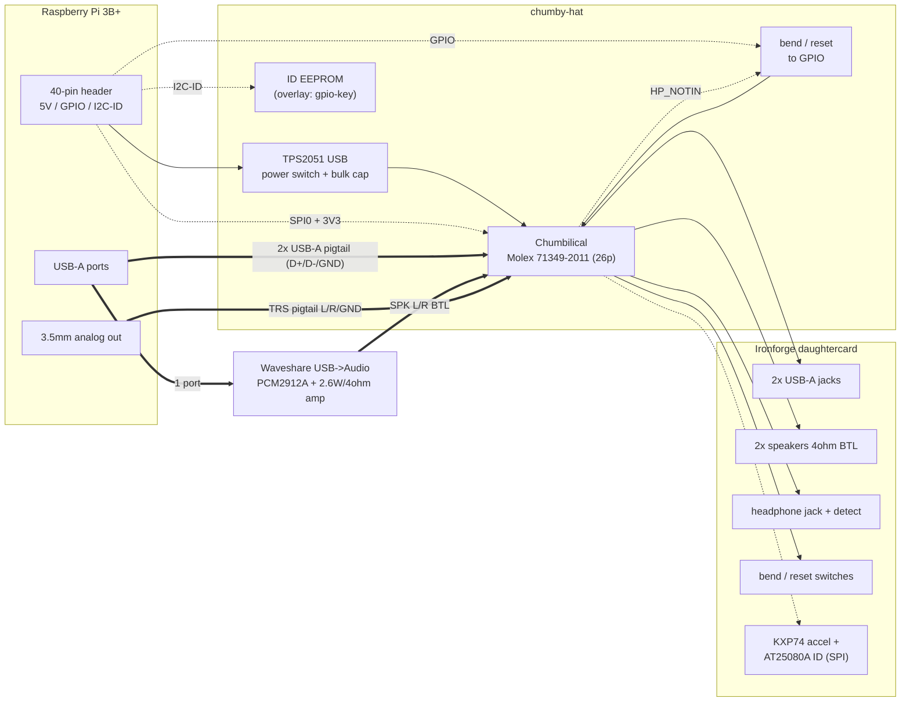

# Chumby Daughterboard HAT

A Raspberry Pi 3B+ HAT that revives the **Chumby Classic "Ironforge"
daughtercard** — its two USB-A ports, two passive speakers, headphone
jack, and the bend/reset switches — after the original mainboard is gone.

Everything the daughtercard needs used to live on the mainboard (USB
transceivers, audio codec, speaker amps, regulators). The daughtercard
is mostly a breakout — the switches, jacks and speakers all reach the
mainboard across one ribbon, the **"chumbilical"** — but it is not
passive: it carries two SPI chips, the **Kionix KXP74-1050
accelerometer** and the **Atmel AT25080A** daughtercard-ID EEPROM
(see [accelerometer.md](accelerometer.md)). This HAT replaces the
mainboard's front-end for the parts we care about, and pushes the hard
audio problem off-board onto USB + the Pi's own jack.

> **Status: schematic-capture stage.** The KiCad project is scaffolded
> from the official KiCad 9 `RaspberryPi-HAT` template (HAT-spec outline,
> 40-pin socket, ID EEPROM, mounting holes). The net-level design below
> is the capture spec; the wired schematic is not drawn yet.

## Architecture

## The chumbilical (daughtercard breakout cable)

Connector **P701, Molex 71349-2011, 26-pin 2×13**, shield on `EMI_GND`.
The 71349 series is Molex **C-Grid**: 2.54 mm (0.100") pitch, 0.64 mm
(0.025") square posts — the standard jumper-wire/pin-header grid, so
the cable's receptacle takes ordinary male jumper wires for
prototyping, and `P1` can be a standard 2×13 0.1" shrouded header.
Nets are read from `pdf/IRONFORGE_MX21_V1_8_FINAL.pdf` (sheet 5). The net
list is certain; **the exact pin numbers below are provisional** — read
off a raster schematic — and must be confirmed by beeping out the
physical cable before copper.

| Pin | Net | Used by HAT? | Goes to |
|----:|-----|:---:|---------|
| 1 | `BATTERY` | – | (mainboard battery sense; unused) |
| 2 | `RAW_PWR` | – | 10–15.5 V wall input; **unused** (power is external) |
| 3/5 | `CSPI1_MISO` / `CSPI1_MOSI` | ✓ | daughtercard SPI (accel + ID EEPROM) → Pi SPI0 MISO/MOSI |
| 4/6/8 | `CSPI1_SCLK` / `SS0` / `SS1` | ✓ | daughtercard SPI → Pi SCLK / CE0 / CE1 |
| 7 | `CHUMBY_RESET_REQ` | ✓ | reset switch → GPIO27 |
| 9/10 | `P33VBKUP` / (spare) | ✓ | presumed 3.3 V for the SPI chips ← Pi 3V3 (**verify**) |
| 11/12 | `USBB_DN` / `USBB_DP` | ✓ | USB port A → Pi USB (pigtail) |
| 13/14 | `USBB2_DN` / `USBB2_DP` | ✓ | USB port B → Pi USB (pigtail) |
| 15 | `CHUMBY_BEND` | ✓ | bend switch → GPIO17 (FR3) |
| 16 | `P50V` | ✓ | USB VBUS for **both** ports ← TPS2051 |
| 17 | `HP_NOTIN` | ✓ | headphone-present → GPIO22 (sink switch) |
| 18/20 | `HPLEFT` / `HPRIGHT` | ✓ | headphone audio ← Pi 3.5 mm jack |
| 21/23 | `SPKL_VO2` / `SPKL_VO1` | ✓ | left speaker (BTL pair) ← USB amp |
| 22/24 | `SPKR_VO2` / `SPKR_VO1` | ✓ | right speaker (BTL pair) ← USB amp |
| 25 | `GND` | ✓ | ground |
| 26 | `EMI_GND` | ✓ | cable shield → GND |

## What the HAT does, breakout by breakout

**USB ×2 — pigtail, data on the HAT, power switched.** The daughtercard
USB-A jacks are just connectors (D+/D−/VBUS/GND). Two short USB-A
pigtails from the Pi's own ports carry **data + ground** to `USBB` /
`USBB2`. VBUS for **both** jacks is the single `P50V` (pin 16), fed from
the Pi 5 V header rail through a **TPS2051-class current-limit switch**
(soft-start, ~1 A limit, short-circuit + thermal fault) plus a ≥22 µF
bulk cap at the connector — so a shorted dongle can't brown out the Pi.
Optional BAT54S-style TVS clamps on the four data lines restore the ESD
protection the mainboard had.

**Speakers ×2 — off-HAT (USB audio module).** Passive 4 Ω BTL speakers.
Driven by a **Waveshare USB→Audio module** (PCM2912A + 2.6 W/ch @ 4 Ω
BTL Class-D) plugged into a Pi USB port; its BTL outputs wire onto the
`SPKx_VO1/VO2` pairs. Matches the project's existing "mpv → USB sound
card" audio path.

**Headphone + detect — off-HAT (Pi analog).** The Pi's onboard 3.5 mm
jack (a TRS pigtail: L→`HPLEFT`, R→`HPRIGHT`, sleeve→`GND`) feeds the
daughtercard headphone jack. `HP_NOTIN` (pin 17) → GPIO22 signals
insertion; software switches the default sink to the Pi analog out and
silences the USB module (auto-mute is software here, not a codec).

**Accelerometer + ID EEPROM — Pi SPI0.** The card's two SPI chips
(KXP74-1050 accel, AT25080A `dcid` EEPROM) sit on `CSPI1` with two chip
selects; wire them to Pi SPI0 (`CE0`/`CE1`), 3.3 V logic both sides.
No Linux driver exists for the KXP74 — PiHost reads it over `spidev`
and answers the panel's ASnative(5,60)/(5,61) natives from live values.
Which select is which chip, and which pin powers the chips (presumed
`P33VBKUP`), must be probed. Full detail: [accelerometer.md](accelerometer.md).

**Bend / reset — GPIO.** Switch-to-GND on the daughtercard.
`CHUMBY_BEND` → **GPIO17** (matches FR3's `gpio-key` design),
`CHUMBY_RESET_REQ` → **GPIO27**. Pi internal pull-ups (the mainboard's
pull-ups are gone with it).

**Power — external.** A single external 5 V supply powers the Pi
normally; the HAT taps the header 5 V for `P50V`. The daughtercard's
own DC jack (`RAW_PWR`, ~12 V) is unused. Size the supply for Pi
(~2.5 A peak) + USB peripherals (~1 A) ⇒ **≥ 3 A recommended**.

## GPIO map (BCM)

| GPIO | Phys | Signal | Notes |
|-----:|-----:|--------|-------|
| GPIO17 | 11 | `CHUMBY_BEND` | bend/squeeze, `gpio-key` overlay (FR3) |
| GPIO27 | 13 | `CHUMBY_RESET_REQ` | reset button |
| GPIO22 | 15 | `HP_NOTIN` | headphone-detect → sink switch |
| GPIO23 | 16 | USB `EN` | TPS2051 enable (or strap on, drop the GPIO) |
| GPIO24 | 18 | USB `/FAULT` | TPS2051 fault flag (optional) |
| GPIO10/9/11 | 19/21/23 | `CSPI1_MOSI/MISO/SCLK` | SPI0 to accel + ID EEPROM |
| GPIO8/7 | 24/26 | `CSPI1_SS0/SS1` | SPI0 CE0/CE1 (chip↔select mapping TBD) |
| ID_SD/ID_SC | 27/28 | I²C ID EEPROM | reserved by HAT spec (template) |

## Key parts

- **J1** 2×20 socket to the Pi header *(template)*
- **P1** chumbilical receptacle — mate to whatever the cable terminates
  in (mainboard side was Molex **71349-2011**); confirm against the cable
- **U2** TPS2051B (single) / TPS2052B (dual) USB power-distribution switch
- **U1** CAT24C256 ID EEPROM + `ID_WP` jumper, 2×3.9 k pulls *(template)*
- **C** ≥22 µF bulk on `P50V`; optional TVS on USB data lines
- external: Waveshare USB→Audio module; 2× USB-A pigtail; 3.5 mm TRS pigtail

## Software touchpoints (follow-on, not built)

- `HP_NOTIN`→GPIO22 handler that flips the PipeWire/mpv default sink
  between the USB module (speakers) and Pi analog (headphones); ties into
  the existing `CHUMBY_AUDIO_DEVICE` mechanism.
- HAT EEPROM overlay (or `config.txt`) mapping GPIO17→bend and GPIO27→reset
  via `gpio-key`, so the buttons work on plug-in without hand-editing.
- KXP74 reader in PiHost over `spidev` (SPI0 on, no kernel driver
  exists), feeding the ASnative(5,60)/(5,61) accelerometer natives that
  today return a fixture constant — see [accelerometer.md](accelerometer.md).

## Verify on the physical board (ground truth)

1. Beep the cable to confirm the **pin-number ↔ net** mapping above.
2. Confirm both USB-A **VBUS pins tie to `P50V`** (pin 16) on the daughtercard.
3. Measure **speaker impedance** (expected 4 Ω) — sizes/validates the amp.
4. Identify the **exact mating connector** the cable ends in; source `P1` to match
   (expected: C-Grid-compatible 2×13 receptacle, 2.54 mm / 0.64 mm posts).
5. Confirm `CHUMBY_BEND` / `CHUMBY_RESET_REQ` are plain **switch-to-GND**.
6. Determine which chip select (`SS0`/`SS1`) is the **accelerometer**
   vs. the **ID EEPROM**, and which pin **powers** them (presumed
   `P33VBKUP`, pin 9).

## References

- Schematics: `pdf/IRONFORGE_MX21_V1_8_FINAL.pdf` (git-ignored, mainboard
  HW 3.8/final) — sheet 5 chumbilical + USB, sheet 1 audio, sheet 4 power.
  `pdf/Rev37_release.pdf` (HW 3.7, same board, earlier rev) is the same
  document family. Source:
  [chumby wiki, Hacking hardware](http://wiki.chumby.com/index.php?title=Hacking_hardware_for_chumby).
- Gerbers: `pdf/gerbers_IRONFORGE_MX21_V1_8_FINAL.zip` (git-ignored,
  extracted alongside it) — mainboard only, same source page. Full copper/
  silk/mask/paste/inner-layer/drill/pick-place set, viewable in KiCad's
  GerbView.

### Daughtercard files — none found (search closed 2026-07-16)

Everything above is the **mainboard**. The board this project actually
targets is the physically separate daughtercard (silked "Ironforge
Daughtercard v1.10" on the unit in hand) — a schematic or Gerber set for
*that* board specifically was searched for and not found:

- The wiki hardware page (raw HTML, not just its rendered links) — mainboard
  files only.
- Two chumbysphere forum threads discussing the daughtercard by name
  (post [#3193](https://forum.chumby.com/viewtopic.php?id=3193), and
  [#2291](http://forum.chumby.com/viewtopic.php?id=2291)) — descriptive
  text only, no design-file links.
- Internet Archive CDX index for the entire `chumby.com` domain, filtered
  for anything matching `daughter` — zero results across its whole archived
  history.
- CDX for `files.chumby.com/hdwedocs/*` (8 files total — all mainboard
  revisions: `Rev37_release.pdf`, `Core_37_gerbers.zip` [=mainboard v1.7,
  confirmed by unzipping — its internal folder is
  `IRONFORGE_MX21_V1_7`], `hardware_v3_7.pdf`, `silvermoon_OEM_ref_v3.pdf`
  [a different, later product], `Chumby_flatpattern.pdf`, `craft.zip`) and
  for `files.blueocty.com` (the community mirror currently serving the
  wiki's download links) — no daughtercard entry in either.
- GitHub search for `ironforge`/`daughtercard` + chumby — no repos.
- bunnie Huang's (chumby's hardware designer) GitHub account
  (`sutajiokousagi`, 60+ repos) — has `dcid` (the daughtercard ID-flash
  tool's source, referenced in `ruffle/claude-docs/design.md`'s identity
  model section) and `cpi`/`cpid` (the crypto-chip tool), but no
  hardware-design repo for the daughtercard.

Conclusion: Chumby's HDK release covered the mainboard only; the simpler,
passive daughtercard's design files were never published or archived
anywhere reachable. The chumbilical pin table above is derived from the
mainboard schematic's P701 connector definition plus physical
verification — there is no daughtercard-side source to cross-check it
against. Jan is asking in the chumby forum directly as the next step.

- KiCad base: official `RaspberryPi-HAT` template (KiCad 9,
  `/usr/share/kicad/template/`), HAT Mechanical Specification.
- Project requirement: FR3 (`claude-docs/requirements.md`) — bend on GPIO17.
